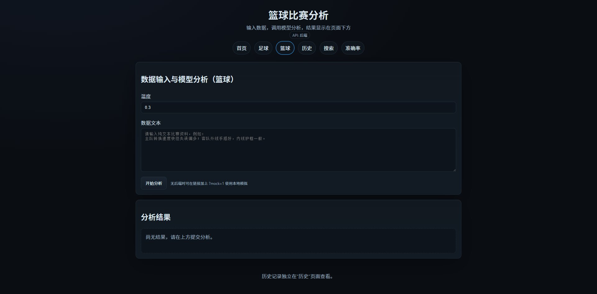
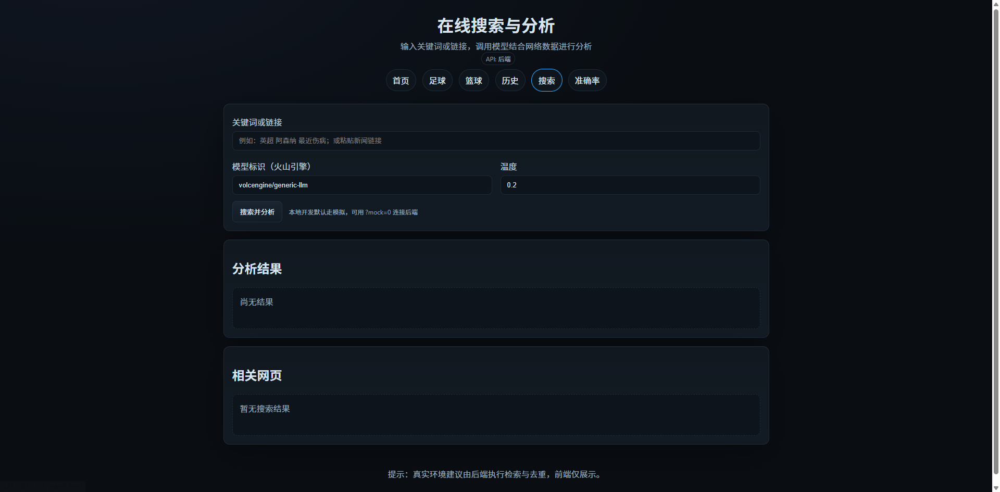
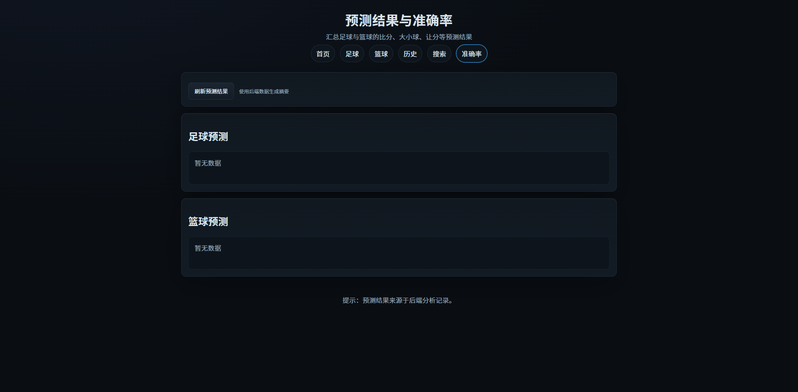

# 运行页面截图与使用说明

## 预览入口
- 足球：
- 篮球：
- 历史：
- 搜索：
- 准确率：

## 使用步骤

- 启动服务：`python main.py serve --host 127.0.0.1 --port 5175`
- 搜索与提炼：打开 `搜索` 页面，输入比赛问题，点击“搜索并分析”
  - 上方结果面板展示模型提炼的摘要/要点/风险（来源索引与下方链接对应）
  - 下方“相关网页”展示命中的标题与链接
- 预测结果汇总：打开 `准确率` 页面，点击“刷新预测结果”
  - 展示足球、篮球最近分析的“比分预测 / 大小球 / 让分”等信息
- 历史记录：`历史` 页面查看过去分析与会话时间线

## API 快速参考

- 搜索：`POST /api/search`
  - 请求：`{ "query": "曼城 vs 利物浦 预测", "temperature": 0.2 }`
  - 响应：`{ ok, query, createdAt, summary(json字符串), hits }`
- 比赛分析：`POST /api/analyze`
  - 请求：`{ sport: 'football'|'basketball', dataText, modelId?, temperature? }`
  - 响应：结构化结果（含 `predictions.score`、`betting_advice` 等）
- 结果列表：`GET /api/results?sport=football|basketball`
- 结果详情：`GET /api/results/{id}`

## 常见问题

- 数据库未配置：未设置 MySQL 时会自动回退到 SQLite（创建 `analyze.sqlite3`）
- 模型不可用：检查 `.env` 中 `VOLC_API_KEY`/`VOLC_MODEL`，或临时接受标题聚合的兜底结果
- 端口占用：换用 `--port 5174` 或其他空闲端口